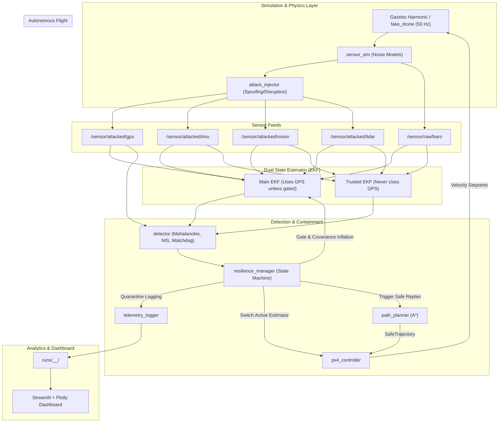

# Cyber-Resilient Autonomous Drone Navigation System

> **Simulation-only project.** All cyberattack scenarios and resilience algorithms run in simulated software (PX4 SITL / Gazebo / ROS 2 / Kinematic Engine). Nothing interacts with real drones, physical networks, or live navigation infrastructure.

---

## 1. Overview & The Two Deliverables

The system enables an autonomous drone to detect, isolate, and recover from severe cyberattacks on its navigation sensor suite in real time:

| # | Deliverable | Proof & Audience Demonstration |
|---|---|---|
| **D1** | **Simulated Drone Attack Environment** with normal navigation plus GPS spoofing, sensor manipulation, and comm disruption | Clean flight, then a visible derailment when an attack starts (**Defense OFF**) |
| **D2** | **Resilience & Recovery System**: detect, isolate bad data, switch to trusted sensors, generate safe alternative trajectory | Same attack with **Defense ON**: banner turns red, bad sensor quarantined, safe path drawn, drone reaches goal, sensor reintegrated |

**Golden Rule:** Every scenario is evaluated twice (**Defense OFF** vs **Defense ON**). The measured contrast is the proof.

---

## 2. Architecture



---

## 3. Repository Layout

```text
Cyber_Resilient_Autonomous_Drone_Navigation_System/
  README.md                     # Complete documentation & usage guide
  requirements.txt              # Python requirements
  requirements.lock             # Pinned reproducible dependencies
  run_all.sh                    # Linux/macOS one-command verification script
  run_all.bat                   # Windows one-command verification script
  config/
    sensors.yaml                # Sensor rates, noise sigmas, drift models
    estimator.yaml              # 10-state EKF process and measurement covariances
    detector.yaml               # Mahalanobis, NIS chi^2, watchdog thresholds
    resilience.yaml             # State machine, dwell times, ramp durations
    planner.yaml                # Grid resolution, obstacle coordinates, cost weights
    scenarios/
      s0_normal.yaml            # Baseline clean flight (0 false alarms target)
      s1_gps_drift.yaml         # GPS ramped drift (+15m, -10m over 5s)
      s2_gps_jump.yaml          # Instant 30m GPS jump
      s3_imu_bias.yaml          # Constant 0.8 m/s^2 accel bias
      s4_lidar_corrupt.yaml     # 0.6x LiDAR range corruption
      s5_comm_disrupt.yaml      # 30% drop, 500ms delay, 10s blackout
      s6_gps_plus_delay.yaml    # Combined GPS drift + latency
  src/
    cyber_drone/                # Core standalone algorithmic library
      ekf.py                    # 10-state EKF (Main & Trusted)
      anomaly_detector.py       # Residual & statistical checks + hysteresis
      resilience_manager.py     # State machine, gating, quarantine, gradual recovery
      astar_planner.py          # Risk-aware A* with obstacle inflation (2.0m -> 3.5m)
      attack_injector.py        # Cyberattack simulation layer
      sensor_sim.py             # Ground truth kinematics to noisy sensor feeds
      simulation_engine.py      # Closed-loop mission simulation engine
      metrics.py                # Detection, Navigation, Resilience, Mission metrics
  tools/
    run_scenario.py             # CLI to run individual scenarios
    run_batch.py                # Batch runner (7 scenarios x 2 modes x 5 seeds)
    metrics.py                  # Metrics extractor and inspector
  dashboard/
    app.py                      # Interactive Streamlit + Plotly dashboard
  tests/
    unit/
      test_ekf.py               # EKF predict, update, NIS tests
      test_detector.py          # Anomaly detection & false alarm tests
      test_planner.py           # A* safety & obstacle inflation tests
      test_resilience.py        # Containment & gradual recovery tests
    scenario/
      test_scenarios.py         # End-to-end scenario regression tests
  ros2_ws/src/                  # Standard ROS 2 Humble packages
    drone_interfaces/           # Custom msgs: AttackStatus, SensorTrust, SafeTrajectory
    fake_drone/                 # Kinematic drone publisher (50 Hz)
    sensor_sim/                 # Sensor simulation node
    attack_injector/            # Attack injection node
    estimator/                  # Dual EKF estimation node
    detector/                   # Residual detector node (10 Hz)
    resilience_manager/         # Resilience manager node
    path_planner/               # A* trajectory planner node
    px4_controller/             # Trajectory controller node (20 Hz)
    telemetry_logger/           # Telemetry and quarantine logger
  simulation/
    worlds/arena.sdf            # Gazebo Harmonic 100m x 100m arena
    launch/drone_system.launch.py # Complete ROS 2 system launch
```

---

## 4. Quick Start & Execution

### 1. Install Dependencies
```bash
pip install -r requirements.txt
```

### 2. Run Test Suite
```bash
pytest tests/ -v
```

### 3. Run Individual Scenarios (Defense OFF vs ON)
Run GPS drift scenario with defense **OFF** (watch the drone derail):
```bash
python tools/run_scenario.py --scenario s1_gps_drift --defense off --seed 42
```
Run same scenario with defense **ON** (watch real-time containment & recovery):
```bash
python tools/run_scenario.py --scenario s1_gps_drift --defense on --seed 42
```

### 4. Run Batch Benchmark (All 7 Scenarios)
```bash
python tools/run_batch.py --seeds 42 101 --scenarios s0_normal s1_gps_drift s2_gps_jump s3_imu_bias s4_lidar_corrupt s5_comm_disrupt s6_gps_plus_delay
```
This generates `runs/reports/batch_summary.csv` with full comparative statistics.

### 5. Launch Interactive Dashboard
```bash
streamlit run dashboard/app.py
```
Explore:
- **Tab 1: Attack Simulation (D1)** - View true trajectory vs spoofed sensor path.
- **Tab 2: Resilience & Recovery (D2)** - State transitions, sensor trust bars, quarantined GPS points, A* safe path.
- **Tab 3: Comparative Analysis** - Side-by-side OFF vs ON comparison and leaderboard.

---

## 5. Topic and Message Contract

| Topic | Type | Rate | Description |
|---|---|---|---|
| `/truth/pose` | `geometry_msgs/PoseStamped` | 50 Hz | Ground truth (used only for evaluation, never by detector) |
| `/sensor/attacked/gps` | `geometry_msgs/PointStamped` | 10 Hz | GPS position after attack injection |
| `/sensor/attacked/imu` | `sensor_msgs/Imu` | 100 Hz | IMU linear acceleration & angular rate |
| `/sensor/raw/baro` | `std_msgs/Float32` | 20 Hz | Barometric altitude |
| `/sensor/attacked/lidar`| `sensor_msgs/LaserScan` | 10 Hz | 2D LiDAR range scan |
| `/sensor/attacked/vision`| `geometry_msgs/PoseStamped`| 20 Hz | Visual odometry position and yaw |
| `/estimate/main` | `nav_msgs/Odometry` | 50 Hz | EKF state estimate with GPS |
| `/estimate/trusted` | `nav_msgs/Odometry` | 50 Hz | EKF state estimate strictly without GPS |
| `/resilience/attack_status` | `drone_interfaces/AttackStatus` | 10 Hz | Anomaly diagnosis & risk score |
| `/resilience/sensor_trust` | `drone_interfaces/SensorTrust` | 10 Hz | Trust score per sensor (0.0 to 1.0) |
| `/resilience/navigation_mode`| `std_msgs/String` | on change | Current system operational state |
| `/planner/safe_trajectory` | `drone_interfaces/SafeTrajectory` | on replan | Waypoints, speed limits, and risk |
| `/control/cmd_vel` | `geometry_msgs/Twist` | 20 Hz | Velocity setpoint for drone flight |
